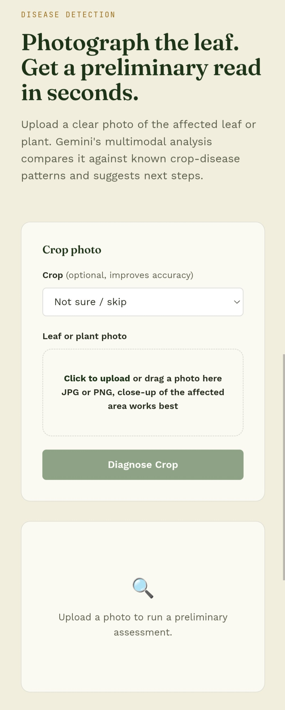

# 🌾 AgriT

**AI-powered agricultural intelligence for smarter farming.**

AgriT is an AI-powered agricultural assistant designed to help farmers make practical, informed decisions. It combines **Google Gemini AI**, a **FastAPI backend**, and a simple farmer-friendly web interface to provide crop advisory, disease screening, and field intelligence.

## Features

### 🌱 Farm Advisory

Get personalized agricultural guidance based on:

* Crop
* Farm location
* Soil type
* Additional farm notes
* Irrigation requirements
* Fertilization guidance
* Pest-risk assessment
* Recommended farming timing

AgriT provides conservative recommendations and avoids claiming access to live data when it is not available.

### 🦠 Crop Disease Detection

Upload a plant image and AgriT uses Gemini's vision capabilities to provide:

* Possible disease identification
* Confidence score
* Symptom description
* General treatment and management guidance

Disease detection is intended as a preliminary screening tool and should not replace confirmation from a qualified agricultural expert.

### 🛰️ Farm Intelligence

Enter a farm location to receive field indicators including:

* NDVI
* Soil moisture estimate
* Temperature estimate
* Rainfall estimate
* Six-point NDVI trend
* Field intelligence notes

> **Note:** The current intelligence endpoint uses AI-based planning estimates. It does not directly access live satellite imagery, weather stations, or Google Earth Engine.

## Technology

* **Frontend:** HTML, CSS, JavaScript
* **Backend:** Python + FastAPI
* **AI:** Google Gemini API
* **Validation:** Pydantic
* **Deployment:** Docker
* **Environment management:** Python dotenv

## Project Structure

```text
AgriT/
├── backend/
│   └── main.py
│
├── css/
│   └── style.css
│
├── js/
│   ├── api.js
│   ├── script.js
│   └── i18n.js
│
├── index.html
├── advisory.html
├── disease.html
├── intelligence.html
│
├── requirements.txt
├── Dockerfile
├── .dockerignore
├── .gitignore
└── README.md
```

## API Endpoints

### Health Check

```http
GET /health
```

Returns backend and Gemini configuration status.

### Farm Advisory

```http
POST /api/advisory
```

Example request:

```json
{
  "crop": "Cotton",
  "location": "Pune, Maharashtra",
  "soilType": "Black soil",
  "notes": "Crop is 45 days old"
}
```

### Disease Detection

```http
POST /api/disease
```

Accepts a PNG or JPEG image as a Base64 data URL.

Example:

```json
{
  "imageBase64": "data:image/jpeg;base64,...",
  "crop": "Tomato"
}
```

### Farm Intelligence

```http
POST /api/intelligence
```

Example request:

```json
{
  "location": "Pune, Maharashtra"
}
```

## Environment Variables

Create a `.env` file locally:

```env
GEMINI_API_KEY=your_gemini_api_key
GEMINI_MODEL=gemini-3.5-flash
ALLOWED_ORIGINS=*
LOG_LEVEL=INFO
MAX_IMAGE_BYTES=8388608
```

### Security

**Never commit `.env` or your Gemini API key to GitHub.**

The Gemini API key must remain on the backend.

For production deployment, configure `GEMINI_API_KEY` through your hosting provider's environment variables or secret manager.

## Local Development

### 1. Clone the repository

```bash
git clone YOUR_REPOSITORY_URL
cd AgriT
```

### 2. Create a virtual environment

Windows:

```bash
python -m venv .venv
.venv\Scripts\activate
```

Linux/macOS:

```bash
python3 -m venv .venv
source .venv/bin/activate
```

### 3. Install dependencies

```bash
pip install -r requirements.txt
```

### 4. Configure Gemini

Create `.env`:

```env
GEMINI_API_KEY=your_gemini_api_key
GEMINI_MODEL=gemini-3.5-flash
```

### 5. Start the backend

From the project root:

```bash
uvicorn backend.main:app --reload --port 8000
```

Open:

```text
http://127.0.0.1:8000
```

Health check:

```text
http://127.0.0.1:8000/health
```

## Docker

AgriT can be deployed as a Docker container.

Build the image:

```bash
docker build -t agrit .
```

Run the container:

```bash
docker run -p 8000:8000 \
  -e GEMINI_API_KEY="your_gemini_api_key" \
  agrit
```

Open:

```text
http://localhost:8000
```

### Docker Environment Variables

For production, configure:

```text
GEMINI_API_KEY
GEMINI_MODEL
ALLOWED_ORIGINS
LOG_LEVEL
MAX_IMAGE_BYTES
```

Do not hard-code secrets inside the Dockerfile.

## Production Deployment

AgriT can be deployed to platforms that support Docker containers, including:

* Render
* Railway
* Google Cloud Run
* Other Docker-compatible cloud platforms

The application listens on:

```text
0.0.0.0:8000
```

For platforms that provide a dynamic `PORT` environment variable, the start command can be configured to use that platform-provided port.

## AI Safety

AgriT is designed to provide **decision support**, not professional agricultural certification.

The application:

* Does not claim unavailable live observations.
* Avoids unsafe pesticide dosage recommendations.
* Communicates uncertainty when information is insufficient.
* Treats disease detection as preliminary screening.
* Encourages local expert confirmation for serious crop disease outbreaks.

Farmers should follow applicable local agricultural regulations and product labels when using agricultural chemicals.

## Current Intelligence Limitation

The Farm Intelligence endpoint currently generates planning estimates using Gemini based on the supplied location.

It does **not** currently connect directly to:

* Google Earth Engine
* Live satellite imagery
* Weather stations
* Live rainfall sensors
* Soil sensors

Future versions can replace these estimates with actual agricultural data providers.

## Roadmap

* [ ] Live satellite NDVI
* [ ] Google Earth Engine integration
* [ ] Live weather data
* [ ] Real rainfall observations
* [ ] Soil moisture datasets
* [ ] Crop-specific models
* [ ] Regional pest alerts
* [ ] Farmer history and saved farms
* [ ] Multi-language improvements
* [ ] Mobile application
* [ ] Agricultural market intelligence

## Languages

The current interface supports:

* English
* हिंदी
* मराठी

## 📸 Screenshots

### Home Page


### Disease Detection


### Farm Advisory


## Contributing

Contributions are welcome.

1. Fork the repository.
2. Create a feature branch.
3. Make your changes.
4. Test the application locally.
5. Submit a pull request.

Please do not commit API keys, credentials, `.env` files, or other secrets.

## License

Add your preferred license here.

For example:

```text
MIT License
```

## Disclaimer

AgriT provides AI-generated agricultural information for general decision support. Information may be incomplete or inaccurate and should not be treated as a guaranteed diagnosis, professional agricultural consultation, or substitute for local expert advice.

---

**AgriT — Making modern agricultural intelligence simpler and more accessible for farmers.**
